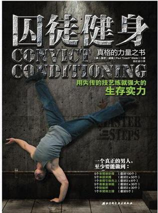

# 我们程序猿本该如祖先一样四肢发达-囚徒健身

前端周刊 - 第15期 - SAFS Fund FE - Dengdeng

最近在发现自己身体状况大不如从前，特别是大学毕业后从事前端开发工作。常常沉浸在编码乐趣中，活动量少，加上久坐导致身体素质大不如从前，长此以往，对健康必定造成影响。

因此，我一直在寻找最适合自己的锻炼方式，于是，我在亚马逊上找到了著名的《囚徒健身》，打算通过亲身实践，总结出一套对程序员行之有效的健身方法论。我暂且称之为《程序员健身宝典》

那么，请你跟我一起来吧！

## 1. 阅读笔记

### 1.1 六艺

| 名称 | 备注 | 难度等级 |
| ----- | ------ | -------: |
| 俯卧撑 | 锁腰身体保持水平 | 一般 |
| 倒立 | 手掌抓地身体前倾 | 困难 |
| 引体向上 | 锁腰身体保持水平 | 一般 |
| 桥 | 手掌抓地身体前倾 | 困难 |

### 1.2 十式

## 2. 实践记录

- 俯卧撑 100 x 5 组

- 划船 100 x 2 组

- 引体向上 10 x 2 组
